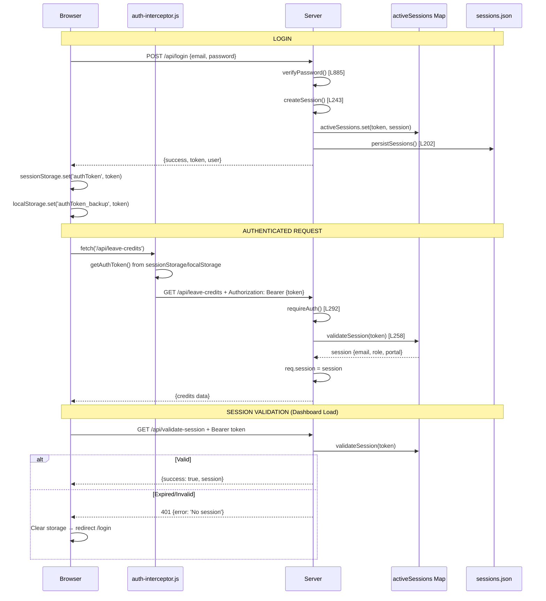
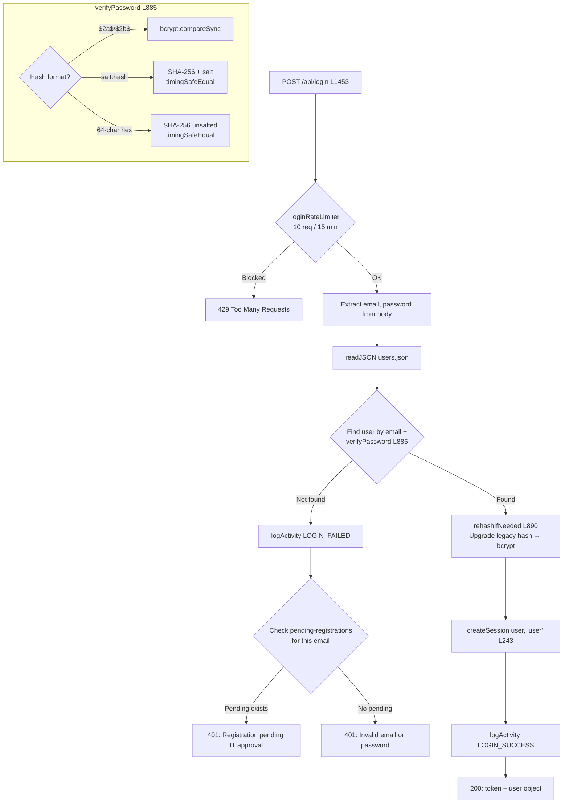
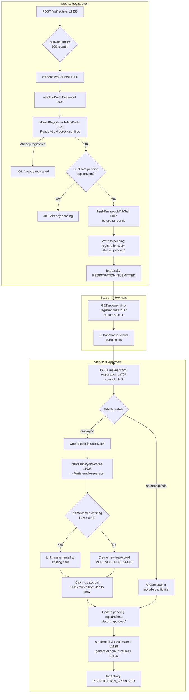
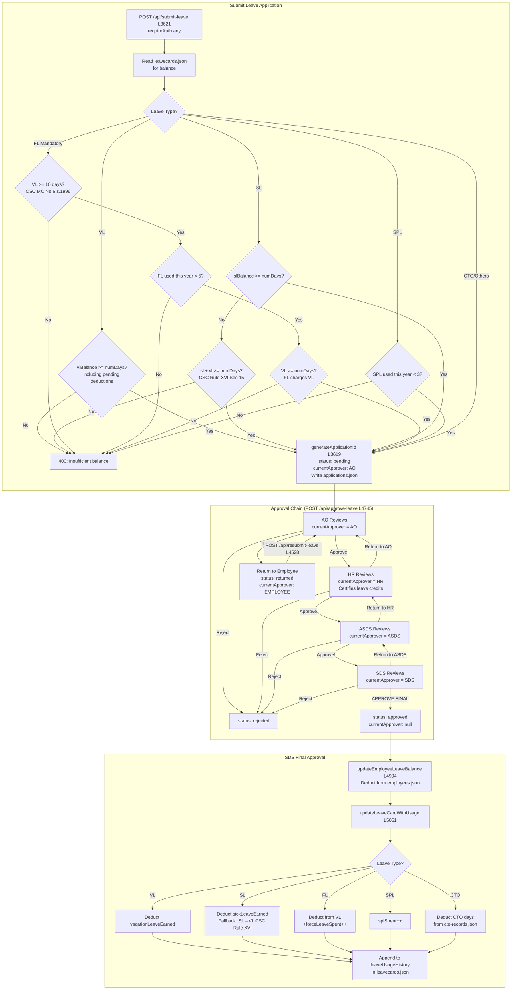
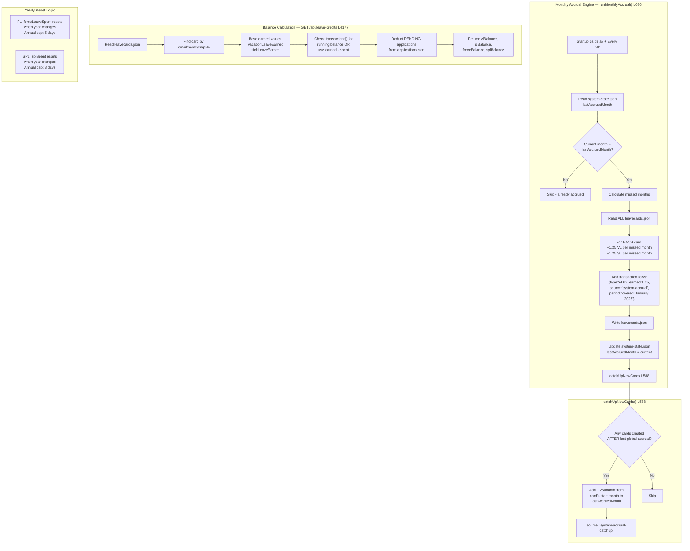
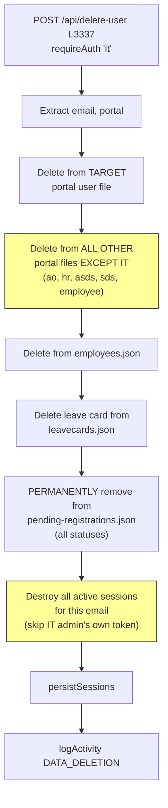

# Backend Architecture — CS Form No. 6 Leave Management System

> **File:** `server.js` (~6,404 lines)  
> **Runtime:** Node.js + Express.js  
> **Storage:** JSON flat files in `data/` directory  
> **Auth:** Bearer tokens (96-char hex, 8-hour expiry, in-memory + persisted)

---

## Table of Contents

1. [System Overview Diagram](#1-system-overview-diagram)
2. [Data Files Map](#2-data-files-map)
3. [Authentication & Session Flow](#3-authentication--session-flow)
4. [Employee Login Flow](#4-employee-login-flow)
5. [IT Login Flow](#5-it-login-flow)
6. [Registration + IT Approval Flow](#6-registration--it-approval-flow)
7. [Leave Application + Approval Chain](#7-leave-application--approval-chain)
8. [Leave Card & Credits System (1.25 Monthly Accrual)](#8-leave-card--credits-system-125-monthly-accrual)
9. [Delete User Flow](#9-delete-user-flow)
10. [Password/PIN Reset Flow](#10-passwordpin-reset-flow)
11. [All API Endpoints Reference](#11-all-api-endpoints-reference)
12. [All Helper Functions Reference](#12-all-helper-functions-reference)
13. [Middleware Stack](#13-middleware-stack)
14. [Scheduled Tasks](#14-scheduled-tasks)
15. [Security Mechanisms](#15-security-mechanisms)
16. [Where to Insert New Functions](#16-where-to-insert-new-functions)

---

## 1. System Overview Diagram

```mermaid
graph TB
    subgraph CLIENTS["🌐 Browser Clients"]
        EMP[Employee Portal<br>login.html → dashboard.html]
        IT[IT Portal<br>it-login.html → it-dashboard.html]
        AO[AO Portal<br>ao-login.html → ao-dashboard.html]
        HR[HR Portal<br>hr-login.html → hr-approval.html]
        ASDS[ASDS Portal<br>asds-login.html → asds-dashboard.html]
        SDS[SDS Portal<br>sds-login.html → sds-dashboard.html]
    end

    subgraph SERVER["⚙️ Express Server (server.js)"]
        MW[Middleware Stack<br>CORS → bodyParser → sanitize → no-cache]
        RL[Rate Limiters<br>login: 10/15min • api: 100/min]
        AUTH[requireAuth middleware<br>Bearer token validation]
        
        subgraph ENDPOINTS["API Endpoints"]
            LOGIN_EP[Login Endpoints<br>L1453, L1740, L1854, L2026, L2141, L2185]
            REG_EP[Registration Endpoints<br>L1358, L1672, L1791, L1896, L2071]
            LEAVE_EP[Leave Endpoints<br>L3621, L4528, L4745]
            CREDIT_EP[Credit Endpoints<br>L4177, L4367, L4422, L4639]
            USER_EP[User Management<br>L3337, L3515, L1517, L1598]
            DATA_EP[Data Management<br>L5476, L5547, L5585, L5614]
        end
        
        subgraph HELPERS["Helper Functions"]
            HASH[Password Hashing<br>bcrypt/SHA-256]
            SESSION[Session Manager<br>create/validate/destroy]
            ACCRUAL[Monthly Accrual<br>1.25 VL+SL/month]
            LOGGER[Activity Logger<br>10K entry cap]
            BALANCE[Balance Calculator<br>VL/SL/FL/SPL]
        end
    end

    subgraph DATA["📁 Data Files (data/)"]
        UF[users.json<br>Employee accounts]
        ITF[it-users.json<br>IT accounts]
        AOF[ao-users.json<br>AO accounts]
        HRF[hr-users.json<br>HR accounts]
        ASDSF[asds-users.json<br>ASDS accounts]
        SDSF[sds-users.json<br>SDS accounts]
        EMPF[employees.json<br>Employee records]
        LCF[leavecards.json<br>Leave cards & credits]
        APF[applications.json<br>Leave applications]
        PRF[pending-registrations.json<br>Registration queue]
        CTOF[cto-records.json<br>CTO records]
        ALF[activity-logs.json<br>Audit trail]
        SSF[system-state.json<br>Accrual state]
        SESSF[sessions.json<br>Active sessions]
    end

    CLIENTS --> MW --> RL --> AUTH --> ENDPOINTS
    ENDPOINTS --> HELPERS
    HELPERS --> DATA
```



---

## 2. Data Files Map

```mermaid
graph LR
    subgraph USER_FILES["👤 User Account Files"]
        U[users.json<br>Employee accounts]
        IT[it-users.json<br>IT staff - PIN auth]
        AO[ao-users.json<br>Admin Officers]
        HR[hr-users.json<br>HR staff]
        ASDS[asds-users.json<br>ASDS]
        SDS[sds-users.json<br>SDS]
    end
    
    subgraph EMPLOYEE_DATA["📋 Employee Data Files"]
        E[employees.json<br>Full employee records<br>+ leaveCredits]
        LC[leavecards.json<br>VL/SL earned/spent<br>FL/SPL caps<br>transactions[]<br>leaveUsageHistory[]]
        APP[applications.json<br>Leave applications<br>+ approval chain state]
        CTO[cto-records.json<br>Compensatory Time-Off<br>days granted/used]
    end
    
    subgraph SYSTEM_FILES["🔧 System Files"]
        PR[pending-registrations.json<br>Registration queue]
        SS[system-state.json<br>lastAccruedMonth<br>lastAccrualRun]
        AL[activity-logs.json<br>Audit trail - 10K cap]
        SESS[sessions.json<br>Persisted session tokens]
        IC[initial-credits.json<br>Excel import lookup]
        SCH[schools.json<br>Schools by district]
    end
    
    U -->|"approved registration"| E
    E -->|"linked by email"| LC
    LC -->|"balance check"| APP
    APP -->|"SDS final approve"| LC
    APP -->|"CTO leave type"| CTO
    PR -->|"IT approves"| U
    PR -->|"IT approves"| E
    PR -->|"IT approves"| LC
```

**File path:** Each file is at `data/{filename}` (or `RAILWAY_VOLUME_MOUNT_PATH/data/{filename}` in production)

| Variable (server.js) | File | Content |
|---|---|---|
| `usersFile` | `users.json` | `[{id, email, password(bcrypt), name, office, position, salaryGrade, step, salary, role:'user'}]` |
| `itUsersFile` | `it-users.json` | `[{id, email, password(bcrypt PIN), name, role:'it'}]` |
| `aoUsersFile` | `ao-users.json` | `[{id, email, password, name, fullName, role:'ao'}]` |
| `hrUsersFile` | `hr-users.json` | `[{id, email, password, name, fullName, role:'hr'}]` |
| `asdsUsersFile` | `asds-users.json` | `[{id, email, password, name, fullName, role:'asds'}]` |
| `sdsUsersFile` | `sds-users.json` | `[{id, email, password, name, fullName, role:'sds'}]` |
| `employeesFile` | `employees.json` | `[{id, email, name, firstName, lastName, office, position, leaveCredits:{}, ...}]` |
| `leavecardsFile` | `leavecards.json` | `[{id, email, employeeId, name, vacationLeaveEarned, sickLeaveEarned, ..., transactions[], leaveUsageHistory[]}]` |
| `applicationsFile` | `applications.json` | `[{id, email, leaveType, numDays, status, currentApprover, aoApprovedAt, hrApprovedAt, ...}]` |
| `pendingRegistrationsFile` | `pending-registrations.json` | `[{id, email, password, portal, status:'pending/approved/rejected', ...}]` |
| `ctoRecordsFile` | `cto-records.json` | `[{id, email, soNumber, daysGranted, daysUsed, ...}]` |
| `activityLogsFile` | `activity-logs.json` | `[{id, timestamp, action, portalType, userEmail, ip, details}]` |
| `systemStateFile` | `system-state.json` | `{lastAccruedMonth:'2026-01', lastAccrualRun:'2026-02-01T...'}` |

---

## 3. Authentication & Session Flow



### Key functions (server.js):
| Function | Line | Purpose |
|---|---|---|
| `generateSessionToken()` | L219 | `crypto.randomBytes(48).toString('hex')` → 96-char token |
| `createSession(user, portal)` | L243 | Store in Map + persist to disk. 8-hour expiry |
| `validateSession(token)` | L258 | Check Map + expiry. Delete if expired |
| `destroySession(token)` | L271 | Remove from Map + persist |
| `requireAuth(...roles)` | L292 | Middleware: extract Bearer token → validate → check role → set `req.session` |
| `persistSessions()` | L202 | Write Map to `sessions.json` |
| `loadPersistedSessions()` | L214 | Read `sessions.json` on startup |

---

## 4. Employee Login Flow



---

## 5. IT Login Flow

```mermaid
flowchart TD
    A[POST /api/it-login L2185] --> B{loginRateLimiter}
    B -->|OK| C[Extract email, pin]
    C --> D{PIN matches /^\d{5,}$/}
    D -->|No| E[400: PIN must be 5+ digits]
    D -->|Yes| F[readJSON it-users.json]
    F --> G{Find user by email +<br>verifyPassword pin}
    G -->|Not found| H[401: Invalid IT email or PIN]
    G -->|Found| I[rehashIfNeeded]
    I --> J[createSession user, 'it']
    J --> K[200: token + user]
```

---

## 6. Registration + IT Approval Flow



---

## 7. Leave Application + Approval Chain



### Approval Chain State Tracking:
| Approver | Sets on Approve | Reads |
|---|---|---|
| **AO** (L4745) | `aoApprovedAt`, `aoName` | `applications.json` |
| **HR** (L4745) | `hrApprovedAt`, `authorizedOfficerName`, certified VL/SL earned/less/balance | `applications.json`, `leavecards.json` |
| **ASDS** (L4745) | `asdsApprovedAt`, `asdsOfficerName` | `applications.json` |
| **SDS** (L4745) | `finalApprovalAt`, `sdsOfficerName`, `status:'approved'` | `applications.json`, `employees.json`, `leavecards.json`, `cto-records.json` |

---

## 8. Leave Card & Credits System (1.25 Monthly Accrual)



### Accrual Math:
- **Rate:** 1.25 days VL + 1.25 days SL per month per employee
- **Trigger:** `runMonthlyAccrual()` at startup + every 24 hours
- **Tracking:** `system-state.json` → `lastAccruedMonth` (e.g., `"2026-01"`)
- **New employees:** `catchUpNewCards()` gives them retroactive accrual from Jan to current month
- **Transaction format:** Each accrual creates a row in `transactions[]`:
  ```json
  {
    "type": "ADD",
    "date": "2026-02-01",
    "periodCovered": "January 2026 (Monthly Accrual)",
    "earned": 1.25,
    "column": "VL",
    "source": "system-accrual"
  }
  ```

---

## 9. Delete User Flow



**Important notes:**
- IT accounts are **NOT** touched during cross-portal cleanup (IT is a separate namespace)
- The requesting IT admin's own session is preserved (prevents self-logout)

---

## 10. Password/PIN Reset Flow

```mermaid
flowchart TD
    subgraph PW_RESET["Password Reset — POST /api/it/reset-password L1517"]
        A1[requireAuth 'it'] --> A2[Extract email, newPassword, portal?]
        A2 --> A3[validatePortalPassword]
        A3 --> A4{Portal specified?}
        A4 -->|Yes| A5[Search that portal's user file]
        A4 -->|No| A6["Search ALL portals EXCEPT IT:<br>employee, ao, hr, asds, sds"]
        A5 & A6 --> A7[hashPasswordWithSalt newPassword]
        A7 --> A8[Update user record]
        A8 --> A9["Destroy ALL sessions<br>for that email"]
        A9 --> A10[logActivity PASSWORD_RESET_BY_IT]
    end
    
    subgraph PIN_RESET["IT PIN Reset — POST /api/it/reset-pin L1598"]
        B1[requireAuth 'it'] --> B2[Extract email, newPin]
        B2 --> B3{newPin matches /^\d{6}$/?}
        B3 -->|No| B4[400: PIN must be exactly 6 digits]
        B3 -->|Yes| B5[Find in it-users.json]
        B5 --> B6[hashPasswordWithSalt newPin]
        B6 --> B7[Update IT user record]
        B7 --> B8[Destroy IT user's sessions]
        B8 --> B9[logActivity PIN_RESET_BY_IT]
    end
```

---

## 11. All API Endpoints Reference

### Authentication & Session (L1305–L1356)
| Line | Method | Path | Auth | Rate Limit | Reads | Writes |
|---|---|---|---|---|---|---|
| L1323 | GET | `/api/health` | None | — | — | — |
| L1328 | GET | `/api/validate-session` | Bearer (manual) | — | activeSessions | — |
| L1340 | POST | `/api/logout` | Bearer (manual) | — | activeSessions | sessions.json, activity-logs.json |

### Employee Portal (L1358–L1516)
| Line | Method | Path | Auth | Rate Limit | Reads | Writes |
|---|---|---|---|---|---|---|
| L1358 | POST | `/api/register` | None | apiRateLimiter | users, pending-regs, all portals | pending-regs, activity-logs |
| L1453 | POST | `/api/login` | None | loginRateLimiter | users, pending-regs | users (rehash), sessions, activity-logs |

### IT Admin Tools (L1517–L1670)
| Line | Method | Path | Auth | Reads | Writes |
|---|---|---|---|---|---|
| L1517 | POST | `/api/it/reset-password` | IT | all portals (except IT) | portal file, sessions, activity-logs |
| L1598 | POST | `/api/it/reset-pin` | IT | it-users | it-users, sessions, activity-logs |
| L1638 | GET | `/api/user-details` | Any | users | — |

### HR Portal (L1672–L1790)
| Line | Method | Path | Auth | Reads | Writes |
|---|---|---|---|---|---|
| L1672 | POST | `/api/hr-register` | None (apiRateLimiter) | hr-users, pending-regs, all portals | pending-regs, activity-logs |
| L1740 | POST | `/api/hr-login` | None (loginRateLimiter) | hr-users, pending-regs | hr-users, sessions, activity-logs |

### ASDS Portal (L1791–L1895)
| Line | Method | Path | Auth | Reads | Writes |
|---|---|---|---|---|---|
| L1791 | POST | `/api/asds-register` | None (apiRateLimiter) | asds-users, pending-regs, all portals | pending-regs, activity-logs |
| L1854 | POST | `/api/asds-login` | None (loginRateLimiter) | asds-users, pending-regs | asds-users, sessions, activity-logs |

### SDS Portal (L1896–L2070)
| Line | Method | Path | Auth | Reads | Writes |
|---|---|---|---|---|---|
| L1896 | POST | `/api/sds-register` | None (apiRateLimiter) | sds-users, pending-regs, all portals | pending-regs, activity-logs |
| L2026 | POST | `/api/sds-login` | None (loginRateLimiter) | sds-users, pending-regs | sds-users, sessions, activity-logs |

### AO Portal (L2071–L2184)
| Line | Method | Path | Auth | Reads | Writes |
|---|---|---|---|---|---|
| L2071 | POST | `/api/ao-register` | None (apiRateLimiter) | ao-users, pending-regs, all portals | pending-regs, activity-logs |
| L2141 | POST | `/api/ao-login` | None (loginRateLimiter) | ao-users, pending-regs | ao-users, sessions, activity-logs |

### IT Portal (L2185–L2312)
| Line | Method | Path | Auth | Reads | Writes |
|---|---|---|---|---|---|
| L2185 | POST | `/api/it-login` | None (loginRateLimiter) | it-users | it-users (rehash), sessions |
| L2218 | POST | `/api/add-it-staff` | IT | it-users | it-users |
| L2258 | POST | `/api/update-it-profile` | IT | it-users | it-users |

### Profile Updates (L2313–L2616)
| Line | Method | Path | Auth | Reads | Writes |
|---|---|---|---|---|---|
| L2313 | POST | `/api/update-employee-profile` | user | users, employees, leavecards | users, employees, leavecards, activity-logs |
| L2398 | POST | `/api/update-ao-profile` | ao | ao-users | ao-users, activity-logs |
| L2455 | POST | `/api/update-hr-profile` | hr | hr-users | hr-users, activity-logs |
| L2508 | POST | `/api/update-asds-profile` | asds | asds-users | asds-users, activity-logs |
| L2562 | POST | `/api/update-sds-profile` | sds | sds-users | sds-users, activity-logs |

### IT Dashboard — User Management (L2617–L3610)
| Line | Method | Path | Auth | Reads | Writes |
|---|---|---|---|---|---|
| L2617 | GET | `/api/pending-registrations` | IT | pending-regs | — |
| L2627 | GET | `/api/all-registered-users` | IT | pending-regs, all portals | — |
| L2677 | GET | `/api/registration-stats` | IT | pending-regs, all portals | — |
| L2707 | POST | `/api/approve-registration` | IT | pending-regs, portal file, employees, leavecards, system-state | portal file, employees, leavecards, pending-regs, activity-logs |
| L3086 | POST | `/api/reject-registration` | IT | pending-regs | pending-regs, activity-logs |
| L3124 | GET | `/api/data-items/:category` | IT | category file | — |
| L3185 | POST | `/api/delete-specific-items` | IT | category file | category file, activity-logs |
| L3242 | POST | `/api/delete-selected-data` | IT | — | category files, activity-logs |
| L3289 | POST | `/api/delete-all-data` | IT + loginRateLimiter | — | ALL data files, activity-logs |
| L3337 | POST | `/api/delete-user` | IT | all portals, employees, leavecards, pending-regs | all portals, employees, leavecards, pending-regs, sessions, activity-logs |
| L3515 | POST | `/api/delete-multiple-users` | IT | portal files, pending-regs, leavecards, employees | same |

### Leave Applications (L3621–L4166)
| Line | Method | Path | Auth | Reads | Writes |
|---|---|---|---|---|---|
| L3621 | POST | `/api/submit-leave` | Any | applications, leavecards | applications, activity-logs |
| L3893 | GET | `/api/application-status/:id` | Any | applications | — |
| L3920 | GET | `/api/my-applications/:email` | Any | applications | — |
| L4005 | GET | `/api/application-details/:id` | Any | applications | — |
| L4027 | GET | `/api/pending-applications/:portal` | ao/hr/asds/sds/it | applications | — |
| L4042 | GET | `/api/approved-applications/:portal` | ao/hr/asds/sds/it | applications | — |
| L4063 | GET | `/api/hr-approved-applications` | asds/sds/it | applications | — |
| L4079 | GET | `/api/all-users` | ao/hr/it | users | — |
| L4089 | GET | `/api/all-applications` | ao/hr/asds/sds/it | applications | — |
| L4101 | GET | `/api/all-employees` | ao/hr/it | users, leavecards | — |
| L4145 | GET | `/api/portal-applications/:portal` | ao/hr/asds/sds/it | applications | — |

### Leave Credits & Cards (L4177–L4744)
| Line | Method | Path | Auth | Reads | Writes |
|---|---|---|---|---|---|
| L4177 | GET | `/api/leave-credits` | Any | leavecards, applications | — |
| L4367 | GET | `/api/leave-card` | Any | leavecards | — |
| L4422 | GET | `/api/employee-leavecard` | Any | leavecards | — |
| L4511 | GET | `/api/returned-applications/:email` | Any | applications | — |
| L4528 | POST | `/api/resubmit-leave` | Any | applications, leavecards | applications |
| L4639 | POST | `/api/update-leave-credits` | ao/it | leavecards | leavecards, activity-logs |

### Leave Approval Engine (L4745–L5220)
| Line | Method | Path | Auth | Reads | Writes |
|---|---|---|---|---|---|
| L4745 | POST | `/api/approve-leave` | hr/ao/asds/sds | applications | applications, employees, leavecards, cto-records, activity-logs |

### CTO Records (L5221–L5316)
| Line | Method | Path | Auth | Reads | Writes |
|---|---|---|---|---|---|
| L5221 | GET | `/api/cto-records` | Any | cto-records | — |
| L5248 | POST | `/api/update-cto-records` | ao/it | cto-records | cto-records |
| L5296 | PUT | `/api/cto-records/:recordId` | ao/it | cto-records | cto-records |

### Activity Logs (L5317–L5475)
| Line | Method | Path | Auth | Reads | Writes |
|---|---|---|---|---|---|
| L5317 | GET | `/api/activity-logs` | IT | activity-logs | — |
| L5381 | GET | `/api/activity-logs-summary` | IT | activity-logs | — |
| L5434 | GET | `/api/export-activity-logs` | IT | activity-logs | — |

### Data Backup/Restore/Migration (L5476–L6277)
| Line | Method | Path | Auth | Reads | Writes |
|---|---|---|---|---|---|
| L5476 | POST | `/api/data/backup` | IT | all data files | backup folder |
| L5503 | GET | `/api/data/backups` | IT | backup dir | — |
| L5525 | DELETE | `/api/data/backup/:backupId` | IT | backup folder | removes folder |
| L5547 | POST | `/api/data/restore` | IT | backup folder, data files | data files + pre-restore backup |
| L5585 | GET | `/api/data/export` | IT | all data files | — |
| L5614 | POST | `/api/data/import` | IT | — | data files + pre-import backup |
| L5680 | POST | `/api/migrate-leave-cards` | IT | leavecards | leavecards, activity-logs |
| L6078 | POST | `/api/migrate-leave-card-json` | IT | leavecards | leavecards, activity-logs |
| L6218 | GET | `/api/system-status` | IT | all user files, leavecards, cto-records | — |
| L6244 | POST | `/api/data/seed` | IT + secret key | — | data file |

---

## 12. All Helper Functions Reference

| Line | Function | Purpose | Called By |
|---|---|---|---|
| L25 | `createRateLimiter(max, windowMs)` | In-memory rate limit middleware factory | loginRateLimiter, apiRateLimiter |
| L76 | `sanitizeInput(input)` | XSS prevention: encode `<>'"` backtick | sanitizeObject |
| L97 | `sanitizeObject(obj)` | Deep-walk objects calling sanitizeInput | Body/query middleware |
| L113 | `isValidEmail(email)` | Regex email check | Available utility |
| L120 | `isEmailRegisteredInAnyPortal(email, exclude)` | Cross-portal uniqueness | All registrations |
| L141 | `isValidDate(dateStr)` | YYYY-MM-DD format | Available utility |
| L175 | `getSessionsFile()` | Lazy path getter (Railway-aware) | persistSessions, loadPersistedSessions |
| L202 | `persistSessions()` | Write activeSessions → sessions.json | createSession, destroySession, cleanup |
| L214 | `loadPersistedSessions()` | Read sessions.json on startup | Startup |
| L219 | `generateSessionToken()` | crypto.randomBytes(48) → 96-char hex | createSession |
| L243 | `createSession(user, portal)` | Store token in Map, 8h expiry, persist | All login endpoints |
| L258 | `validateSession(token)` | Check Map + expiry | requireAuth, validate-session, logout |
| L271 | `destroySession(token)` | Remove + persist | logout |
| L292 | `requireAuth(...roles)` | Middleware: Bearer → validate → role check | Most endpoints |
| L385 | `logActivity(action, portal, details)` | Append to activity-logs (10K cap) | All state-changing ops |
| L424 | `getClientIp(req)` | Extract IP from headers/socket | logActivity |
| L434 | `ensureFile(filepath, default)` | Seed missing file from defaults/ | Startup |
| L494 | `acquireLock/releaseLock(path)` | File-level write locking | Available (not actively used) |
| L508 | `readJSON(filepath)` | Read JSON, strip BOM, recover from .bak | Everywhere |
| L547 | `readJSONArray(filepath)` | readJSON + unwrap {key:[]} format | Applications endpoints |
| L564 | `writeJSON(filepath, data)` | Atomic write: tmp→rename, creates .bak | Everywhere |
| L588 | `catchUpNewCards(lastMonth, now)` | Accrual for late-created cards | runMonthlyAccrual |
| L686 | `runMonthlyAccrual()` | Main accrual: +1.25 VL+SL per month | Startup + 24h interval |
| L828 | `parseFullNameIntoParts(name)` | "LAST, FIRST MID SUFFIX" → parts | Profile updates, migration |
| L847 | `hashPasswordWithSalt(pw)` | bcrypt.hashSync(pw, 12) | All registration/reset |
| L852 | `legacyHashSalted(pw, salt)` | SHA-256 + salt (backward compat) | verifyPasswordDetailed |
| L855 | `legacyHashUnsalted(pw)` | Plain SHA-256 (backward compat) | verifyPasswordDetailed |
| L860 | `verifyPasswordDetailed(pw, hash)` | Detect hash format, verify, flag rehash | verifyPassword |
| L885 | `verifyPassword(pw, hash)` | Boolean wrapper | All login endpoints |
| L890 | `rehashIfNeeded(pw, hash, user, arr, file)` | Auto-upgrade legacy → bcrypt | All login endpoints |
| L900 | `validateDepEdEmail(email)` | Check @deped.gov.ph | All registrations |
| L905 | `validatePortalPassword(pw)` | 6-24 chars, letters+numbers+special | Registrations, pw reset |
| L1003 | `buildEmployeeRecord(...)` | Build employee object with parsed name | approve-registration |
| L1043 | `normalizeNameForMatching(name)` | Uppercase, strip special chars | lookupInitialCredits |
| L1054 | `lookupInitialCredits(name)` | Match VL/SL from initial-credits.json | Migration |
| L1138 | `sendEmail(to, name, subject, html)` | MailerSend HTTPS API | approve-registration |
| L1190 | `generateLoginFormEmail(...)` | HTML email template | approve-registration |
| L3611 | `isSchoolBased(office)` | Check if school-based employee | submit-leave |
| L3619 | `generateApplicationId(apps)` | Sequential `SDO Sipalay-XX-XXXX` | submit-leave |
| L4994 | `updateEmployeeLeaveBalance(app)` | Deduct from employees.json + call updateLeaveCardWithUsage | approve-leave (SDS final) |
| L5051 | `updateLeaveCardWithUsage(app, vl, sl)` | Complex deduction: VL/SL/FL/SPL/CTO + leaveUsageHistory | updateEmployeeLeaveBalance |
| L5639 | `extractCreditsFromBuffer(buf, name)` | Parse Excel leave card | migrate-leave-cards |
| L5728 | `findHeaderRow(data)` | Find header row in Excel | extractCreditsFromBuffer |

---

## 13. Middleware Stack

Requests flow through these in order:

```
Request
  │
  ├─ 1. Security Headers (L151)
  │     X-Content-Type-Options, X-Frame-Options, CSP, HSTS(prod)
  │
  ├─ 2. CORS (L280)
  │     Production: restricted domain │ Dev: allow all
  │
  ├─ 3. bodyParser.json (L284) — 10MB limit
  │
  ├─ 4. bodyParser.urlencoded (L285) — 10MB limit
  │
  ├─ 5. Body Sanitization (L288)
  │     sanitizeObject(req.body), sanitizeObject(req.query)
  │
  ├─ 6. No-Cache HTML (L299)
  │     Cache-Control: no-cache for .html and extensionless paths
  │
  ├─ 7. express.static('public') (L305)
  │
  ├─ 8. Rate Limiter (per-route)
  │     loginRateLimiter: 10/15min │ apiRateLimiter: 100/min
  │
  └─ 9. requireAuth (per-route)
        Bearer token → validateSession → role check → req.session
```

---

## 14. Scheduled Tasks

| Task | Interval | Function | Line |
|---|---|---|---|
| Rate limit cleanup | Every 5 min | Prune expired from `rateLimitStore` | L22 |
| Session cleanup | Every 15 min | Prune expired sessions + persist | L277 |
| Monthly accrual | Startup (5s) + every 24h | `runMonthlyAccrual()` | L686 |
| Heartbeat log | Every 60s | Console "Server still running" | ~L6300 |
| Auto-backup | On startup | Backup all data (keep last 5) | ~L6290 |

---

## 15. Security Mechanisms

| Mechanism | Detail |
|---|---|
| **Password hashing** | bcrypt 12 rounds via `hashPasswordWithSalt()` |
| **Legacy migration** | SHA-256 → bcrypt transparent upgrade on login |
| **Timing-safe compare** | `crypto.timingSafeEqual` for legacy hash verification |
| **Rate limiting** | IP+path based, in-memory Map with cleanup |
| **XSS prevention** | `sanitizeInput()` encodes `<>'"` backtick on all body/query |
| **Session tokens** | 48-byte random (96 hex chars), 8-hour expiry |
| **CORS** | Locked to production domain in prod mode |
| **No-cache** | HTML pages served with `no-store, must-revalidate` |
| **Self-only data** | Employees can only access their own credits/applications |
| **Portal spoofing prevention** | `approve-leave` maps `req.session.role` → portal name |
| **Audit trail** | `logActivity()` records all state changes (capped 10K) |
| **File write safety** | Atomic write (tmp→rename) + .bak backup before write |
| **Path traversal** | `path.basename()` on backup IDs |
| **Delete confirmation** | `DELETE_ALL_DATA_CONFIRM` key required |
| **Password stripping** | Export/API responses strip password fields |

---

## 16. Where to Insert New Functions

### By Category — Best insertion points:

```
server.js Layout:
━━━━━━━━━━━━━━━━━━━━━━━━━━━━━━━━━━━━━━━━━━━━━━━━━━━
L1-24      │ Imports & config
L25-55     │ Rate limiters                    ← New rate limiters
L76-112    │ Sanitization & validation        ← New validators
L113-150   │ Email/date validators            ← New validators
L151-183   │ Security headers
L184-290   │ Session management               ← New session features
L292-310   │ Auth middleware                   ← New middleware
L311-384   │ Static serving & file setup
L385-433   │ Activity logging                 ← New log actions
L434-507   │ File utilities (ensure/lock)
L508-587   │ JSON read/write                  ← New file utilities
L588-827   │ MONTHLY ACCRUAL ENGINE           ← New scheduled tasks
L828-1002  │ Password & name helpers          ← New helpers
L1003-1137 │ Employee record builder          ← New record builders
L1138-1304 │ Email templates                  ← New email templates
━━━━━━━━━━━━━━━━━━━━━━━━━━━━━━━━━━━━━━━━━━━━━━━━━━━
L1305-1320 │ Page routes                      ← New page routes
L1321-1356 │ Health/session/logout
L1358-1516 │ EMPLOYEE login/register          ← New employee endpoints
L1517-1670 │ IT admin tools                   ← New IT tools
L1672-1790 │ HR login/register                ← New HR endpoints
L1791-1895 │ ASDS login/register
L1896-2070 │ SDS login/register
L2071-2184 │ AO login/register
L2185-2312 │ IT login/staff mgmt             ← New IT staff features
L2313-2616 │ Profile updates                  ← New profile features
━━━━━━━━━━━━━━━━━━━━━━━━━━━━━━━━━━━━━━━━━━━━━━━━━━━
L2617-2706 │ IT: pending regs & stats
L2707-3085 │ IT: approve registration         ← Modify approval logic
L3086-3123 │ IT: reject registration
L3124-3336 │ IT: data management
L3337-3610 │ IT: delete user(s)               ← Modify delete logic
━━━━━━━━━━━━━━━━━━━━━━━━━━━━━━━━━━━━━━━━━━━━━━━━━━━
L3611-3892 │ SUBMIT LEAVE                     ← New leave types/validation
L3893-4166 │ Application queries              ← New query endpoints
L4177-4510 │ LEAVE CREDITS & CARDS            ← New credit features
L4511-4638 │ Return & resubmit
L4639-4744 │ Update leave credits (AO)        ← New credit update logic
L4745-4993 │ APPROVE LEAVE ENGINE             ← Modify approval chain
L4994-5050 │ Balance deduction (SDS final)
L5051-5220 │ Leave card usage tracking        ← New usage tracking
━━━━━━━━━━━━━━━━━━━━━━━━━━━━━━━━━━━━━━━━━━━━━━━━━━━
L5221-5316 │ CTO records                      ← New CTO features
L5317-5475 │ Activity logs                    ← New log features
L5476-5638 │ Backup/restore/export/import     ← New data tools
L5639-6077 │ Excel migration                  ← New migration tools
L6078-6217 │ JSON migration
L6218-6277 │ System status & seed
L6279-6404 │ Error handlers & server start
━━━━━━━━━━━━━━━━━━━━━━━━━━━━━━━━━━━━━━━━━━━━━━━━━━━
```

### Common insertion scenarios:

| I want to add... | Insert at | After |
|---|---|---|
| New validation function | ~L910 | `validatePortalPassword` |
| New API middleware | ~L310 | `requireAuth` |
| New page route | ~L1320 | Last `app.get('/...')` route |
| New employee feature | ~L1516 | Before IT admin tools |
| New IT admin tool | ~L1636 | After `reset-pin` |
| New leave type validation | ~L3890 | Inside `submit-leave` logic |
| New approval step | ~L4990 | Inside `approve-leave` engine |
| New credit calculation | ~L4365 | After `leave-credits` endpoint |
| New scheduled task | ~L825 | After accrual engine |
| New email template | ~L1300 | After `generateLoginFormEmail` |
| New data file | ~L382 | After last `ensureFile()` call |
| New helper function | ~L1000 | In the helpers section |
